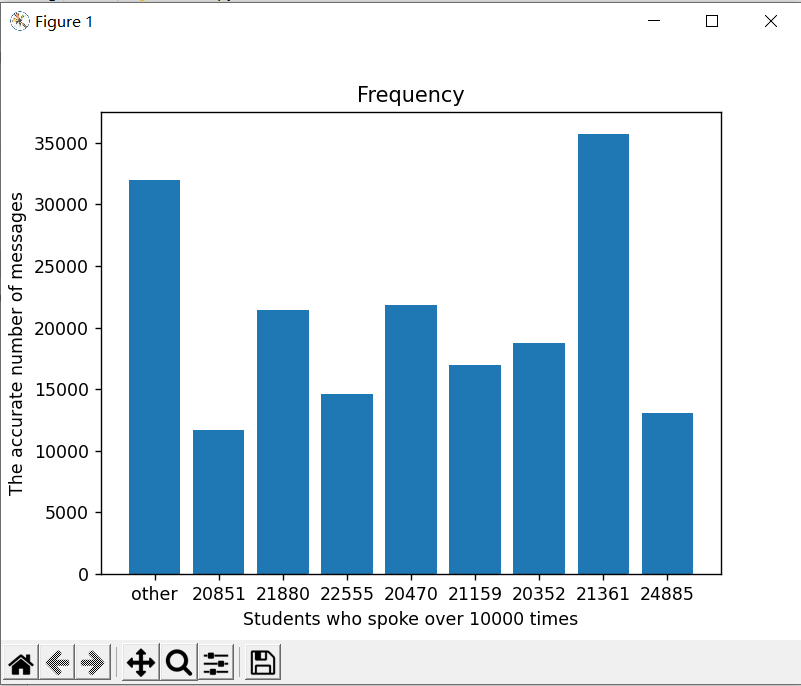

# HuayuChatting
对华育中学qq校友营的聊天记录进行清洗和分析的代码

## 分析流程和代码
### 数据提取|extractor.py
由于QQ聊天记录的高度格式化，可以较容易的用正则表达式对各类数据进行匹配。
```python
import re

def extractHead(filepath:str)->list[str]:
    #filepath='../in/华育校友营_3.txt'
    with open(filepath,'r',encoding='utf-8',errors='ignore') as reader:
        txt:str=reader.read()
    return re.findall(r'20[\d-]{8}\s+[\d:]{7,8}\s+[^\n]+(?:\d{5,11}|@\w+\.[comnet]{2,3})[)>]',txt)
```
### 数据分析
#### 条形统计图|barchart.py
通过python的matplotlib模块进行构图。
```python
import numpy
from matplotlib import pyplot

freqs:list[list]=[[],[],[],[]]
schoolIDs_freq:list[list]=[[],[],[],[]]

def paint():
    x=numpy.array(schoolIDs_freq[0])
    y=numpy.array(freqs[0])
    pyplot.bar(x,y)
    pyplot.xlabel('Students who spoke over 10000 times')
    pyplot.ylabel('The accurate number of messages')
    pyplot.title('Frequency')
    pyplot.show()
```

<p></p>
